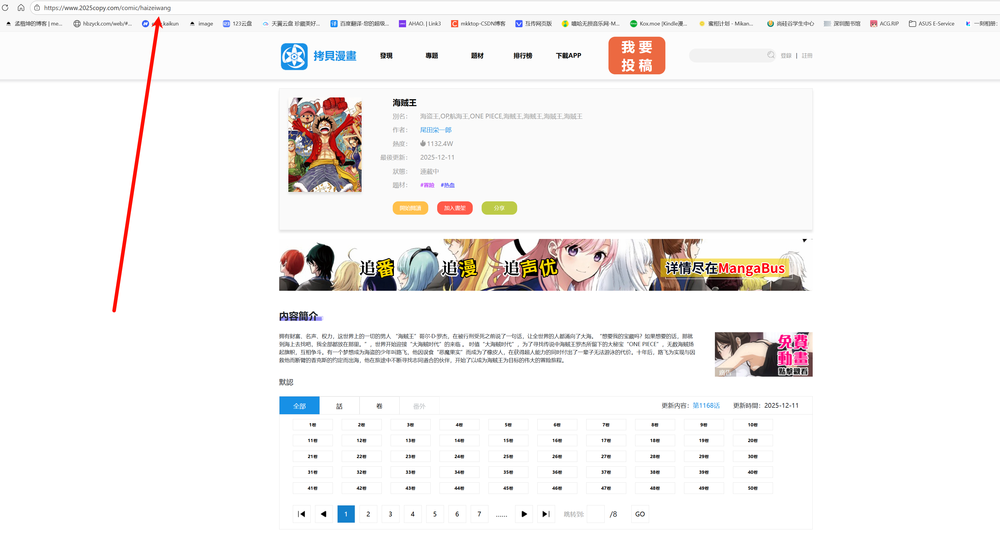
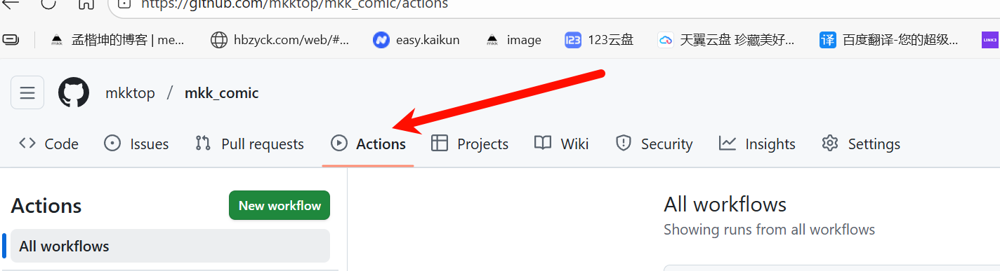
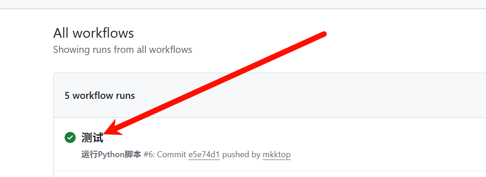
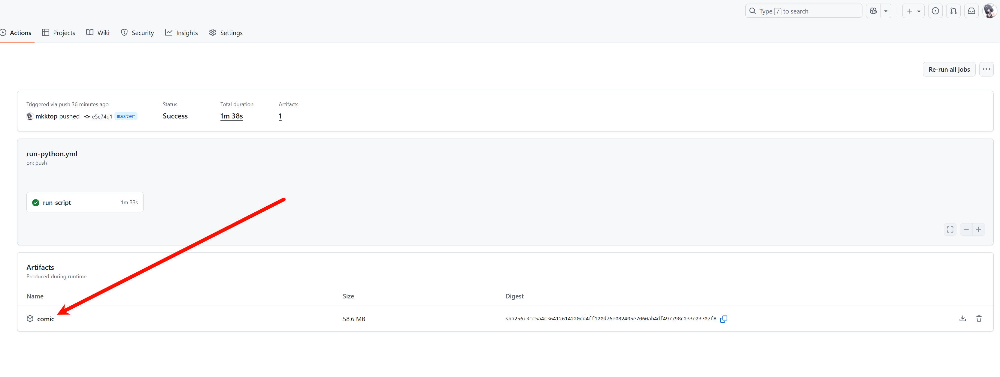

# mkk_comic 漫画下载工具

## 项目简介
这是一个漫画下载和管理工具，支持将下载的漫画图片转换为PDF格式。项目还集成了配置管理功能，可记录漫画的更新状态，方便跟踪最新章节。

## 核心功能

- **自动下载**：通过github Actions 实现自动下载，自动追更
- **急速下载**：不需要科学上网，下载速度极快
- **PDF转换**：将下载的图片自动转换为PDF文件，支持加密保护
- **配置管理**：记录漫画的最后阅读章节和检查时间，便于跟踪更新

## 使用方式

- 获取漫画的订阅地址
  进入网址 https://www.2025copy.com  
选择想要追更的漫画，复制浏览器上的链接地址如:haizeiwang
  

- 进入项目的config文件夹的comic.yaml进行配置
```
global:
  pdf_switch: 0 #是否生成PDF
  pdf_password: None #PDF密码(None为不设置密码)
  
comics:#漫画列表，多个漫画请填写多个
- name: 海贼王 #名称自定义
  path: haizeiwang #漫画订阅地址，按照第一点进行获取
  last_chapter: 373 #订阅起始的章节
  last_check_time: '2025-12-11 05:49:12' #上一次脚本执行时间
```

- 自动执行脚本
- 下载漫画
  
   

- 在页面底部点击下载
   
